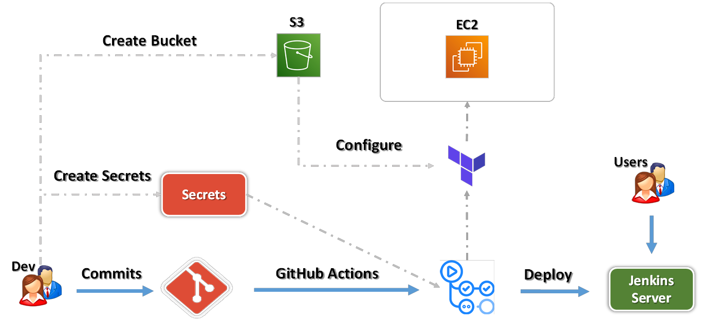

# Deploy Jenkins Container in AWS EC2 using Terraform

## Problem Statement

You are asked to provision infrastructure and deploy Jenkins in a Docker container using Terraform.

- Use Terraform to launch an EC2 instance.
- Ensure Docker is installed on the instance.
- Run Jenkins inside a Docker container

## Prerequisites

- Create AWS Access and Secret Key
- Create IAM user and grant the relevant permission (VPC full and EC2 full)
- Create S3 bucket and make sure your backet name updated in the provider.tf file
- Add Access and secret key in the Github Secret 
- Add a change that you want to commit (may be add an empty line) and push the change

## Execution Flows

